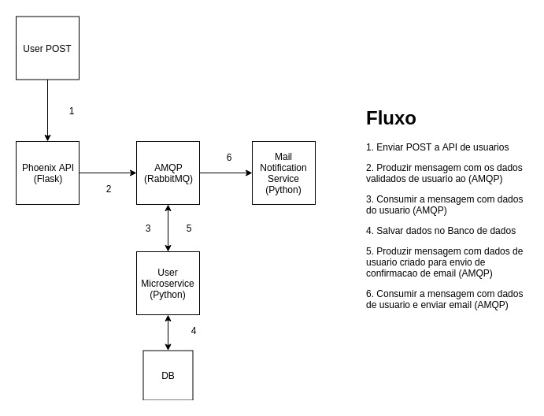

# Liftit Teste

Liftit Teste

# Como Testar a Aplicação

    - docker-compose -f docker-compose.test.yaml up --build
    - docker-compose -f docker-compose.test.yaml down

# Como Executar o Projeto

    - docker-compose up --build
    - Acessar o swagger em http://localhost:5000/
    
    - Requisição Valida:
        curl localhost:5000/users/ -d '{  "nome": "string",  "email": "string",  "telefone": "989529891",  "pais": "string",  "cidade": "string",  "endereco": "string",  "senha": "string",  "verificado": true}' -H 'Content-Type: application/json'

    - Requisição Invalida:
        curl localhost:5000/users/ -d '{"foo": "bar"}' -H 'Content-Type: application/json'

    - É possivel enviar requisições diretamente pelo swagger

# Tecnologias Utilizadas

    - Python
    - Flask, FlaskRestplus
    - RabbitMQ
    - Docker
    - Docker-compose

# Fluxo da Aplicação

# O que melhoraria:
    - Criar Pacote para as funções de conexão e utilidades do AMQP para um Pypi Server Local
    - Testaria as conexões com rabbitmq, saidas de email, e envio e recebimentos de mensagens
    - Deixaria o prefixo base /api/{version} para o API Management
    - Usaria um API Gateway para orquestração e um Edge Router em Produção
    - Salvaria os dados necessarios para os microserviços em bancos Nosql para autonomia dos serviços (com redundancia)